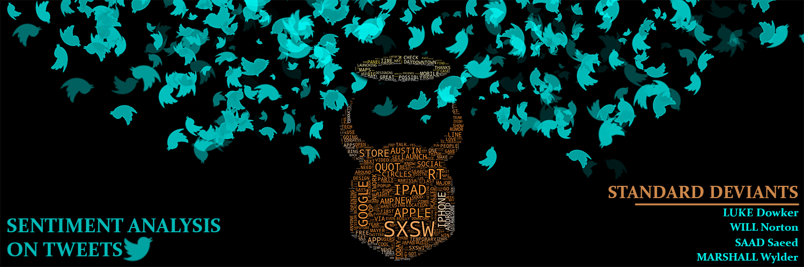

# TweetSentimentAnalysis-NLP
Build an NLP model to analyze Twitter sentiment about Apple and Google products


## Authors:
---
- Luke Dowker: 
[LinkedIn](https://www.linkedin.com/in/luke-dowker-857978ba/) |
[GitHub](https://github.com/toastdeini) |
[Email](lhdowker@gmail.com)
- Saad Saeed: 
[LinkedIn](https://www.linkedin.com/in/saadsaeed85/) |
[GitHub](https://github.com/ssaeed85) |
[Email](mailto:saadsaeed85@gmail.com)
- Marshall Wylder: 
[LinkedIn]() |
[GitHub]()|
[Email](marshall.wylder@gmail.com)
- Will Norton: 
[LinkedIn]() |
[GitHub]() |
[Email](noptov52@yahoo.com)

Our model and analysis can be found at our github repo: [Sentiment Analysis of Tweets](https://github.com/ssaeed85/dsc-ph4-TweetSentimentAnalysis-NLP)

## Business Problem
---

Describe the Business problem

## Data
---
Describe where the data was sourced from.
Describe any additional data gathered and their purpose.
Describe the data itself, what it represents, what are its constituents etc.


## Methodology
---
Describe libraries used especially the primary ones

What was your approach?

Why'd you pick the features you did.

Overall journey.

Create sub sections


## The Model
---
Describe the modeling techniques used. More details on final model. Results of the model.


## Conclusions
---

Conclusions... duh

## Next steps
---

If given more time, what would you do?

## Repository Structure
---
```
├── Workspace  
│     ├── Luke
│     │   ├── Notes.md
│     │   └── *.ipynb
│     ├── Marshall
│     │   ├── Notes.md
│     │   └── *.ipynb
│     └── Saad
│     │   ├── Notes.md
│     │   └── *.ipynb
│     └── Will
│         ├── Notes.md
│         └── *.ipynb
│
├── data
│     ├── datapackage.json
│     └── judge_1377884607_tweet_product_company.csv
├── images
├── README.md
├── **Project_Presentation_Slides**.pdf
└── **Project_Final_Notebook**.ipynb
```


## Citations:
---
Call out any references here