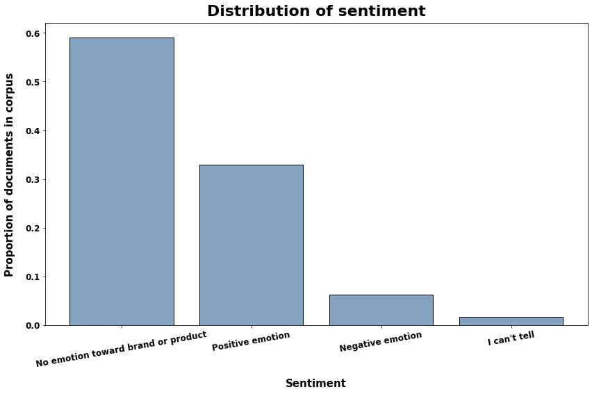
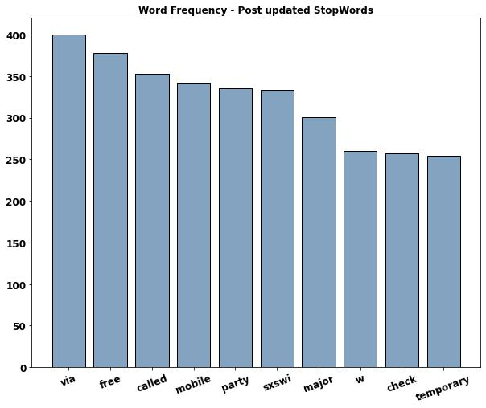

# Tweet Sentiment Analysis Using NLP


## Authors

- Luke Dowker: 
[LinkedIn](https://www.linkedin.com/in/luke-dowker/) |
[GitHub](https://github.com/toastdeini) |
[Email](mailto:lhdowker@gmail.com)
- Will Norton: 
[LinkedIn](https://www.linkedin.com/in/william-norton-jr-43232745/) |
[GitHub](https://github.com/Noptov) |
[Email](mailto:noptov52@yahoo.com)
- Saad Saeed: 
[LinkedIn](https://www.linkedin.com/in/saadsaeed85/) |
[GitHub](https://github.com/ssaeed85) |
[Email](mailto:saadsaeed85@gmail.com)
- Marshall Wylder: 
[LinkedIn](https://www.linkedin.com/in/marshall-wylder-172582159/) |
[GitHub](https://github.com/MarshallWylder) |
[Email](mailto:marshall.wylder@gmail.com)

# Overview & Business Problem

Tweets — brief, character-limited posts that are shared on [Twitter](https://help.twitter.com/en/using-twitter/types-of-tweets) by users) — were scraped and analyzed by human contributors to determine if the text of the tweet contained a positive, negative, or neutral/non-existent sentiment toward a named tech brand or product, e.g. iPhone or Android. Using the ground truths provided by these labels, we employ natural language processing (NLP) techniques to predict whether a string of text (like a tweet) contains a sentiment toward a product. 

Using the Natural Language Toolkit (NLTK) package for Python, along with machine learning tools from scikit-learn, we built several classification models that were able to predict with varying degrees of accuracy whether a tweet contained any emotion toward a product whatsoever, and whether that emotion was positive or negative. Festival organizers and administrators can use this framework to gauge attendee sentiment and address audience needs in a swift and appropriate fashion. Future iterations of our analysis would incorporate more refined upsampling techniques to address class imbalance, training the model on tweets written in languages other than English, and models that identify more *specific* sentiments like emergency.

# Data

The data used in this project is [hosted on data.world](https://data.world/crowdflower/brands-and-product-emotions) and was sourced by the machine learning/AI company CrowdFlower, which has since been acquired by [Appen](https://appen.com/datasets-resource-center/). Per the dataset summary:

> *Contributors evaluated tweets about multiple brands and products. The crowd was asked if the tweet expressed positive, negative, or no emotion towards a brand and/or product. If some emotion was expressed they were also asked to say which brand or product was the target of that emotion.*

The dataset consists of just under 9,100 rows and three columns, all of which contained string data:
- `tweet_text` - the full text of a tweet. The primary feature used in this analysis.
- `emotion_in_tweet_is_directed_at` - if applicable, what product or brand (e.g. Apple, iPhone app, Google, Android app, etc.) the emotion in the tweet is "targeted" at.
- `is_there_an_emotion_directed_at_a_brand_or_product` - The target variable for our analysis, the values in this column indicate whether a human contributor determined the content of the `tweet_text` to contain a positive sentiment, a negative sentiment, or no clear judgmental stance toward a brand/product.

> **Note:** These pre-loaded column names were truncated or otherwise modified for ease of use and code readability.

The majority of the tweets in the dataset were neutral in sentiment - that is, they did not express a positive or negative emotion *toward a brand or product*. Tweets marked as containing either a **positive** or **negative** sentiment made up a smaller proportion of the corpus, and negatively charged tweets made up just 6% of the data, a significant imbalance. Records where the human reviewer could not parse an emotion from the text of a tweet were dropped to reduce 'noise' in the data.



# Methodology

Our initial inquiry into the data quickly revealed that the `tweet_text` (renamed `text`) column would likely be our primary feature for modeling. The text data was subject to the usual preprocessing steps for NLP operations - we used a [Python function](../../src/documentParser.py) that...

- Searches a document for regular expressions and creates tokens, using NLTK's `RegexpTokenizer`. In this case, combinations of alphanumeric characters that immediately follow instances of an `@` symbol were excluded, as these "[mentions](https://en.wikipedia.org/wiki/Mention_(blogging)#@_(At_sign))" have minimal semantic value and muddy the data. Punctuation and other stray characters are removed during tokenization.
- Standardizes the tokens by converting all (alphabetical) characters to *lowercase*.
- Discards the most common English words, which have negligible semantic value, from the list of tokens, using NLTK's `corpus.stopwords` module.
    - **Note:** the stopwords list was also programatically updated to exclude location- and platform-specific strings like "SXSW" or "RT".
- Reduces instances of related words/tokens to common roots, using NLTK's `PorterStemmer`.




To prepare the data (i.e. strings of text) for modeling, we used two vectorization techniques - a simple bag-of-words approach with sklearn's `CountVectorizer` and a term-importance (TF-IDF scoring) approach using the same library's `TfidfVectorizer`. With each vectorization method, we tested for accuracy and F1 score used four unique classification algorithms:
- `RandomForestClassifier`
- `MultinomialNB` (Multinomial Naive Bayes)
- `GradientBoostingClassifier`
- `XGBRFClassifier` (XGBoosted Random Forest)


# Modeling Results

- **Best model:**
    - `CountVectorizer` with `RandomForest` proved most effective
    - Parameters:
        - `criterion` = `gini` (impurity)
        - `max_depth` = 150
        - `n_estimators` = 100
- **Scores/results:**
    - Accuracy on all test data: **69%**
    - Accuracy in filtering, i.e. predicting tweets **without** sentiment: **89%**

This model can be immediately useful by filtering tweets without emotion; the remaining tweets can be tagged for use in an improved sentiment analysis model or sent to a human-in-the-loop to enhance our model in real time.

# Recommendations

- Use the model as a **filtration system**
- **Circulate and reward** positive sentiment
- Address negative sentiment to **boost audience experience**

## Next Steps

- Incorporate **upsampling techiques** like backtranslation and synonymization to better predict on imbalanced classes, i.e. positive or negative emotion.
- Expand the scope of the model such that it can analyze **text from other languages**.
- Use sentiment analysis to improve **emergency response time**.

## Repository Structure
```
├── Workspace  
│     ├── Luke
│     │   ├── draft_README.md
│     │   └── Initial_Cleaning.ipynb
│     ├── Marshall
│     │   ├── README.txt
│     │   └── MW_Notebook.ipynb
│     ├── Saad
│     │   ├── README.txt
│     │   ├── DataCleaning.ipynb
│     │   └── WordCloud.ipynb
│     └── Will
│         ├── README.txt
│         ├── neg_de_train.csv
│         ├── negtrain2.csv
│         ├── neg_translated.csv
│         ├── twice_translated_negtrain.csv
│         ├── translation oversample.ipynb
│         └── modeltranslate2.ipynb
│
├── data
│     └── judge_1377884607_tweet_product_company.csv
├── images
├── model
├── src
├── README.md
├── Presentation_Slides.pdf
├── tweet_sentiment_app.py
└── TweetSentimentAnalysis_nb.ipynb
```

## Other Links

- Full analysis for this project available in the [Jupyter notebook](TweetSentimentAnalysis_nb.ipynb) and group members' [workspaces](../../Workspace).
- Presentation slides available in [.pdf format](../../Presentation_Slides.pdf).